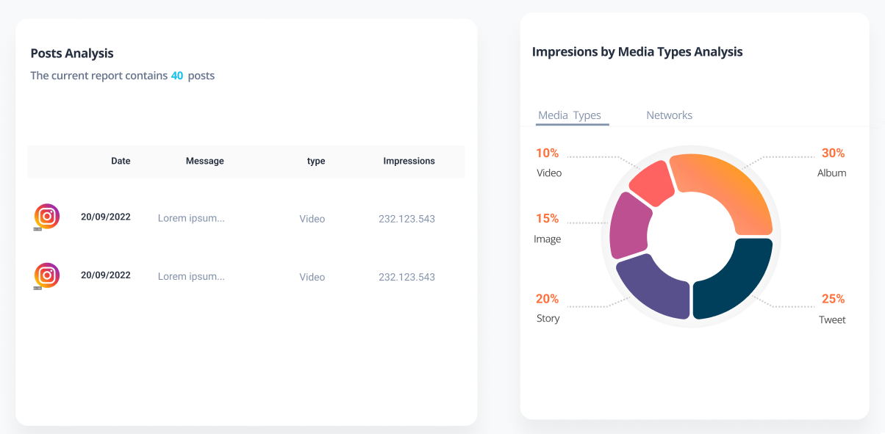
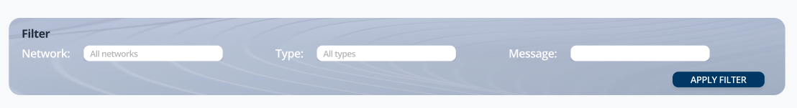

# Horizm Frontend Challenge

## Context
You've just started to work with Horizm, a Digital Asset Platform that build different report related with Social Media Data.

At this point, they need to do a **Posts Report**. This report will be used by different customers to analyse their social media insights. As a frontend, you have to use the **./public/posts_data.json** to get this data (You should to have in count that this file could be heavy, so that you have to read it asychronously)

## What we have to do
Currently, you should focus to complete the following parts:
- Build a table with the post list. Customers usually sort each column, so you need to implement this feature. Furthermore, as you can see in the design, some data is formatted (For example, Network is shown as an icon).

- Implement a graph to analyse impressions by **Media Types** or **Networks**. You can toggle these options to see different data. ***(The title of this section must change reactively)***

- Some customer are asking for a filter to display dynamic data in the table. You have to implement a filter component to display only the filtered data. A customer can filter by **Network**, **Message** or **type** 

## Requirements and tips
- You can create new component files. But you have to use the three current components created to implement this feature.
- You can add Components or Plugins if you need it.
- You have to choose  filter input types (select, input text, input number...).
- Manage and architect CSS assets as you want.
- Don't worry about assets, you can use your own images.

## For an A++
- Implement a button to Download this report in PDF.
- Implement a way to edit posts (Only in the SPA, you don't have to save the new data)